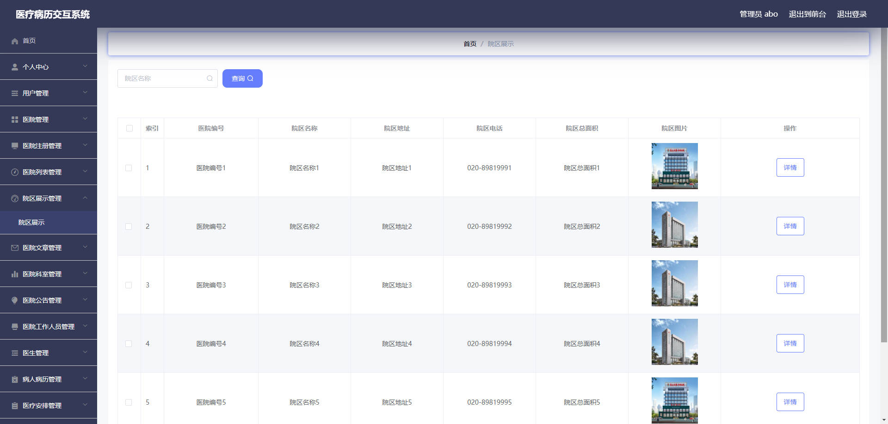

# 基于Springboot的B2B平台的医疗病历交互系统

## Springboot-0061


## 技术栈

Springboot mybatisplus vue mysql maven


## 数据库表(22张)


## 功能介绍

```properties
管理员
个人中心,用户管理,医院管理,医院注册管理,医院列表管理,院区展示管理,医院科室管理,医院文章管理,医院公告管理,工作人员管理,医生管理,病人病历管理,医疗安排管理,科室预约管理,文章类型管理,系统管理

医院
个人中心,院区展示管理,医院文章管理,医院科室管理,医院公告管理,工作人员管理,医生管理,病人病历管理,医疗安排管理,科室预约管理,医生展示管理


医生
个人中心,工作人员管理,病人病例管理,医疗安排管理,科室预约管理


```


## 图片

### 前台


### 后台





## 访问路径

### 前台

```properties
http://localhost:8080/springbootr2r43/front/pages/login/login.html

账号 1
密码 1
```

### 后台

```properties
http://localhost:8080/springbootr2r43/admin/dist/index.html#/login

账号 abo
密码 abo
```


## 功能图


## 文档目录


## 打赏或交流


